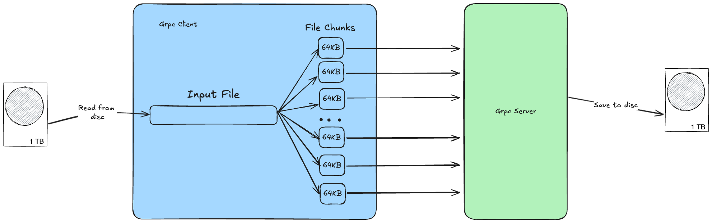

##  Передача файлов через GRPC  
###  Задача
Необходимо передать файлы большого объема (сотни МБ) через gRPC
###  Ограничения
В gRPC как известно есть ограничения на размер передаваемых сообщений - https://github.com/grpc/grpc-go/blob/v1.72.2/rpc_util.go#L347
По умолчанию этот размер установлен в 4МБ.
###  Решение
1. **Во-первых**, необходимо увеличить максимальных размер сообщений 

```go
    grpc.WithDefaultCallOptions(
        grpc.MaxCallRecvMsgSize(100*1024*1024),
        grpc.MaxCallSendMsgSize(100*1024*1024), 
    )
```

Размер увеличен до 100МБ.  

2. **Во-вторых**, разбить файл на куски и отравлять стриммингом эти куски на сервер.  
Размер этих кусков подбирать индивидуально по потребностям, а можно и флаг добавить такой.  
В общем это выглядит так:


###  Рекомендации по запуску
Для запуска севрера необходимо выполнить следующую команду:
```shell
go run cmd/server/main.go
```  
Для запуска клиента необходимо выполнить следующую команду:
```shell
go run cmd/client/main.go -fileName example.txt
```  
Для генерации кода на основе API:
```shell
chmod +x scripts/generate.sh
./scripts/generate.sh
```